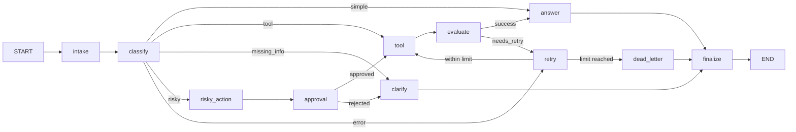

# LangGraph Agentic Orchestration Lab Report

## 1. Team / student

- Name: Phan Huy Hoang
- Repository: Track3-Day23-Stevejobless
- Base commit: `6d8252d3c349` (submission changes are in the current working tree)
- Date: 2026-08-25

## 2. Architecture

The workflow uses eleven focused LangGraph nodes. `intake` normalizes input and
`classify` calls the configured LLM with a Pydantic structured-output schema. Conditional
edges select one of five routes. Read-only tool work passes through an LLM-assisted quality
gate; failures enter a bounded retry loop and exhaust into `dead_letter`. Risky side effects
must pass through `risky_action` and `approval` before the tool executes. Every route reaches
`finalize` and then `END`.

## 3. State schema

| Field | Reducer | Purpose |
|---|---|---|
| `messages` | append | Conversation/audit summaries |
| `tool_results` | append | Immutable history of tool attempts |
| `errors` | append | Retry and failure evidence |
| `events` | append | Node-level audit trail and metrics source |
| `route`, `risk_level` | overwrite | Current classification decision |
| `attempt`, `evaluation_result` | overwrite | Bounded retry-loop control |
| `pending_question` | overwrite | Clarification output |
| `proposed_action`, `approval` | overwrite | Human-approval boundary |
| `final_answer` | overwrite | Terminal user-facing result |

## 4. Scenario results

| Metric | Value |
|---|---:|
| Total scenarios | 7 |
| Success rate | 100.00% |
| Average nodes visited | 6.43 |
| Total retries | 3 |
| Approval/HITL nodes visited | 2 |
| Persistence history verified | yes |

| Scenario | Expected | Actual | Result | Retries | Approval visits | Latency (ms) |
|---|---|---|---:|---:|---:|---:|
| S01_simple | simple | simple | PASS | 0 | 0 | 4364 |
| S02_tool | tool | tool | PASS | 0 | 0 | 2820 |
| S03_missing | missing_info | missing_info | PASS | 0 | 0 | 945 |
| S04_risky | risky | risky | PASS | 0 | 1 | 3439 |
| S05_error | error | error | PASS | 2 | 0 | 4615 |
| S06_delete | risky | risky | PASS | 0 | 1 | 3547 |
| S07_dead_letter | error | error | PASS | 1 | 0 | 719 |

## 5. Failure analysis

1. **Transient tool failure:** an explicit `ERROR` is fail-closed by a deterministic gate even
   when the LLM judge is unavailable. The retry counter increments before another tool call;
   `attempt >= max_attempts` routes to `dead_letter`, so the graph cannot loop forever.
2. **Risky action without approval:** classification marks side effects as high risk. The action
   is only proposed first, and the tool is unreachable until the approval node returns an
   approved decision. Rejection routes to clarification instead of execution.
3. **LLM or provider failure:** classification and answer generation intentionally surface the
   provider error because real LLM use is a lab requirement. The optional evaluator degrades to
   a deterministic error check so safety and retry behavior remain available.

## 6. Persistence / recovery evidence

PASS: checkpoint history was found for every scenario run. Each run uses a unique `thread_id`. The SQLite saver enables WAL mode and
stores checkpoints under `outputs/checkpoints.sqlite`; the CLI verifies both checkpoint history
and a latest-state read-back containing the terminal `finalize` event. Per-thread proof is stored
in `outputs/persistence_evidence.json`. This proves durable state read-back for the lab run, not a
separate process-kill/crash-resume demonstration.

## 7. Extension work

- Durable SQLite checkpointer with WAL and per-run thread IDs.
- State-history verification and `outputs/persistence_evidence.json`.
- Mermaid graph export in `outputs/graph.mmd`.
- LLM-as-judge evaluation with a deterministic fail-closed fallback.

The optional `LANGGRAPH_INTERRUPT=true` path is implemented, but it was not exercised in this
automated evidence run and is therefore not claimed as a verified real-HITL extension. Automated
runs use the documented mock reviewer and must not be treated as production authorization.

## 8. Improvement plan

Replace mock tools and mock approval with authenticated services, role-based reviewer identity,
idempotency keys, and immutable audit storage. Add provider retries/rate-limit handling, tracing,
prompt-injection tests, and a real interrupt/resume UI before production use.
